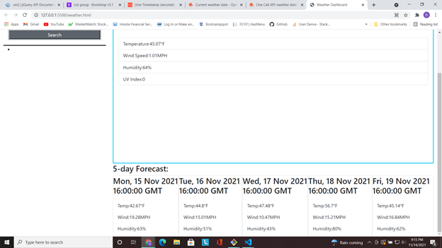

# weather-app

## Description

This repository project is a weather application created and designed from scratch to give users the weather values based on a search of the city. It also provides a 5-day forecast to see future weather values, and an ability to revisit searched for cities.

## Skills Used
A  few of the programs and libraries accessed to make htis project
* HTML
* CSS
* Javascript
* API: [ Jquery, Bootstrap, DayJs, One Call Api, Current Weather Data API]

## Links
* [Website Link](https://demsley1.github.io/weather-app/)
* [Repo Link](https://github.com/Demsley1/weather-app.git)

## Screenshots

 